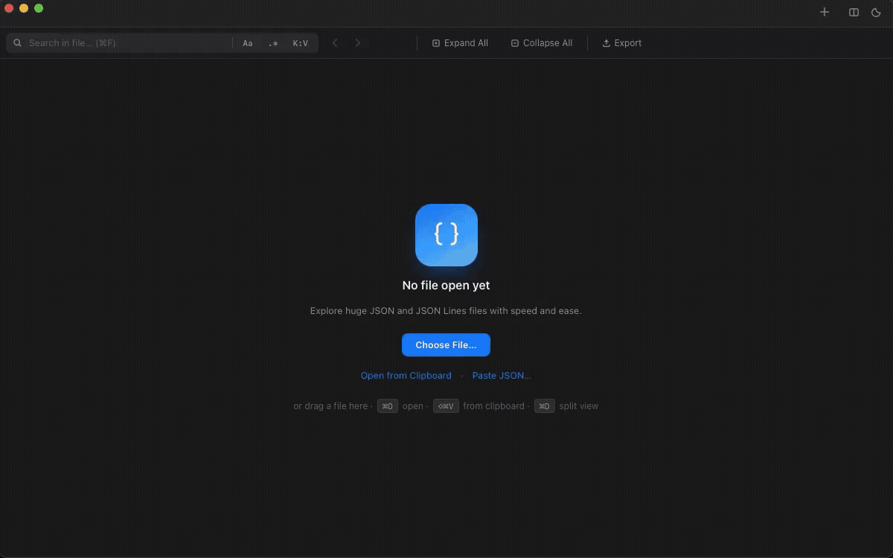
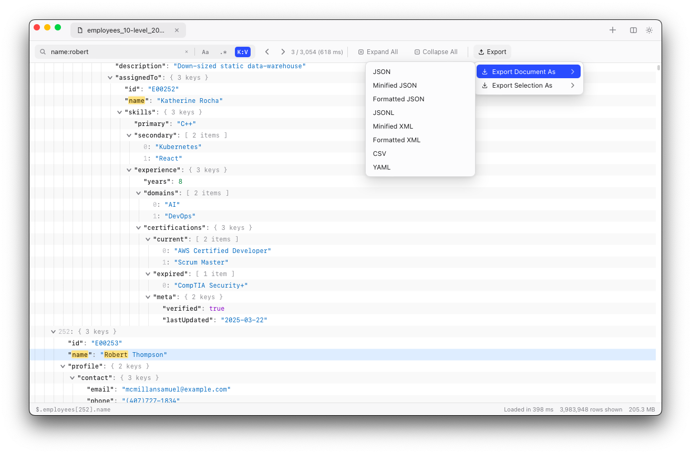
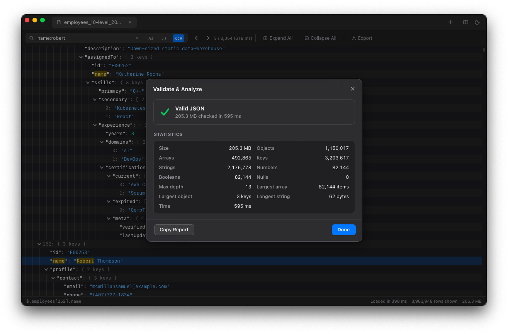

  

  

<h1 align="center">JSONJet</h1>

  <strong>Fast JSON Explorer for Huge Files.</strong>

  Explore huge JSON, JSONL, and NDJSON files quickly and efficiently.

  <a href="https://github.com/muchad/jsonjet/releases/latest">Download</a>
  ·
  <a href="https://muchad.com/jsonjet">Homepage</a>
  ·
  <a href="https://ko-fi.com/muchad">Support Development</a>

## See JSONJet in Action

  

## ✨ Features

- 🚀 **Built for huge files** — explore JSON, JSONL, and NDJSON files from hundreds of MB to several GB.
- 🔎 **Powerful search** — Plain Text, Regex, and Key:Value.
- 🌳 **Fast tree navigation** — lazy loading, Expand All, Collapse All, and virtual scrolling for millions of rows.
- 🧭 **Go to Path** — navigate with JSONPath or JSON Pointer.
- ✅ **Validate & Analyze** — strict validation, detailed errors, and document statistics.
- 📑 **Multi-tab & Split View** — work with multiple documents side by side.
- 📤 **Export** — JSON, JSONL, XML, CSV, and YAML.
- 🖥️ **Native desktop experience** — native menus, Preferences, recent files, drag & drop, and file associations.
- 🎨 **Customizable appearance** — System, Light, and Dark themes, text size, row density, and more.
- ⌨️ **Keyboard friendly** — shortcuts for navigation, search, tabs, zoom, and common actions.

## 📸 Screenshots

  
  
  

## 📥 Download

Download the latest version from **[Releases](https://github.com/muchad/jsonjet/releases/latest)**.

| Platform | Download |
|---|---|
| 🍎 **macOS** | Universal build for Intel and Apple Silicon |
| 🪟 **Windows** | Windows x64 installer |

## 💙 Support Development

If you find JSONJet useful, consider supporting its continued development:

**[Support Development via Ko-fi](https://ko-fi.com/muchad)**
